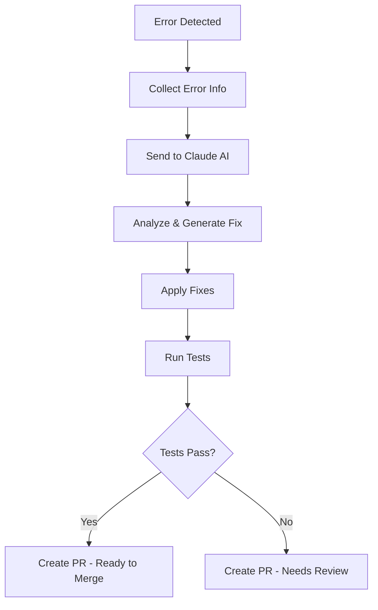

# 🤖 Claude Auto-Fix Setup Guide

## Deskripsi
Claude Auto-Fix adalah sistem otomatis yang menggunakan AI Claude untuk mendeteksi dan memperbaiki error dalam kode secara otomatis. Sistem ini akan:

1. **Mendeteksi Error** - Menganalisis hasil testing, static analysis, dan log error
2. **Menggunakan Claude AI** - Mengirim konteks error ke Claude untuk analisis
3. **Menerapkan Fix** - Otomatis menerapkan perbaikan yang disarankan Claude
4. **Membuat PR** - Membuat Pull Request dengan perbaikan untuk review

## 🚀 Setup Langkah demi Langkah

### 1. Dapatkan Claude API Key

1. Buka [Anthropic Console](https://console.anthropic.com/)
2. Login atau buat akun baru
3. Buat API key baru
4. Copy API key yang dihasilkan

### 2. Tambahkan Secret ke GitHub Repository

1. Buka repository GitHub Anda
2. Pergi ke **Settings** → **Secrets and variables** → **Actions**
3. Klik **New repository secret**
4. Tambahkan secret baru:
   - **Name**: `CLAUDE_API_KEY`
   - **Value**: API key yang Anda copy dari Anthropic Console

### 3. Aktifkan Workflow

Workflow akan otomatis aktif setelah Anda commit file `.github/workflows/claude-auto-fix.yml`.

## 🔧 Cara Kerja

### Trigger Otomatis
Workflow akan berjalan secara otomatis ketika:
- Main deployment pipeline gagal
- Ada error dalam testing atau build process

### Trigger Manual
Anda juga bisa menjalankan secara manual:
1. Buka tab **Actions** di GitHub repository
2. Pilih workflow **"🤖 Claude Auto-Fix Pipeline"**
3. Klik **Run workflow**
4. Atur parameter sesuai kebutuhan

### Proses Auto-Fix



## 🛡️ Fitur Keamanan

### Safety Measures
- ✅ **Conservative Approach** - Hanya memperbaiki error yang jelas dan obvious
- ✅ **Preserve Logic** - Tidak mengubah business logic yang kompleks
- ✅ **No Database Changes** - Tidak menyentuh migration atau schema
- ✅ **Code Review Required** - Semua perubahan melalui Pull Request

### Monitoring
- 📊 **Activity Logging** - Semua aktivitas Claude dicatat
- 🔍 **Change Analysis** - Perubahan dianalisis sebelum diterapkan
- ⚡ **Rollback Ready** - Mudah di-revert jika ada masalah

## 📋 Jenis Error yang Bisa Diperbaiki

### ✅ Yang BISA Diperbaiki
- **Syntax Errors** - Error PHP syntax yang jelas
- **Import/Namespace Issues** - Missing use statements
- **Type Mismatches** - Basic type conversion issues
- **Test Failures** - Simple test assertion fixes
- **Code Style Issues** - PSR-12 compliance fixes
- **Missing Method Calls** - Obvious method calls yang hilang

### ❌ Yang TIDAK Akan Diperbaiki
- **Database Migrations** - Terlalu berisiko
- **Business Logic Complex** - Butuh pemahaman domain
- **Security Issues** - Butuh review manual
- **Performance Issues** - Butuh profiling mendalam
- **Architecture Changes** - Terlalu besar scope-nya

## 🎯 Contoh Penggunaan

### Scenario 1: Test Failure
```
Error: PetugasStatsServiceTest::test_it_formats_statistics_for_display
Expected: 1500000, Actual: 0.0
```

**Claude Auto-Fix akan:**
1. Menganalisis error dan kode terkait
2. Menemukan masalah di query tanggal
3. Mengubah `where()` menjadi `whereDate()`
4. Membuat PR dengan fix

### Scenario 2: Syntax Error
```
PHP Parse error: syntax error, unexpected '}' in app/Services/TestService.php on line 45
```

**Claude Auto-Fix akan:**
1. Mendeteksi missing bracket atau semicolon
2. Memperbaiki syntax error
3. Memastikan kode tetap fungsional

## 📊 Monitoring & Analytics

### GitHub Actions Logs
- Lihat detail error detection
- Monitor Claude API usage
- Track success rate perbaikan

### Pull Request Analysis
- Review semua perubahan yang dibuat Claude
- Lihat explanasi untuk setiap fix
- Check test results setelah fix

## 🔧 Kustomisasi

### Mengatur Error Types
Edit file `claude-auto-fix.yml` bagian error detection untuk menambah/mengurangi jenis error yang dideteksi.

### Mengatur Claude Prompt
Modifikasi bagian `create_fix_prompt()` dalam script Python untuk mengubah instruksi ke Claude.

### Mengatur Safety Rules
Tambah safety rules dalam prompt Claude untuk kontrol lebih ketat.

## 🚨 Troubleshooting

### Claude API Key Issues
```bash
❌ CLAUDE_API_KEY not configured
```
**Solution**: Pastikan API key sudah ditambahkan ke GitHub Secrets

### Rate Limiting
```bash
❌ Claude API error: 429
```
**Solution**: 
- Tunggu beberapa menit sebelum retry
- Check quota di Anthropic Console

### No Changes Made
```bash
🤷 No changes were made by Claude
```
**Possible reasons**:
- Error terlalu kompleks untuk auto-fix
- Claude menganggap tidak aman untuk diubah
- Error sudah fixed di commit sebelumnya

## 💡 Tips & Best Practices

### 1. Regular Monitoring
- Check PR yang dibuat Claude secara regular
- Review changes sebelum merge
- Monitor test results

### 2. API Key Security
- Rotate API key secara berkala
- Jangan commit API key ke code
- Monitor usage di Anthropic Console

### 3. Gradual Rollout
- Test di branch development dulu
- Monitor beberapa PR sebelum full trust
- Adjust safety rules sesuai kebutuhan

### 4. Backup Strategy
- Selalu ada backup sebelum deploy
- Test rollback process
- Monitor production after merge

## 📞 Support

Jika ada masalah dengan Claude Auto-Fix:

1. **Check GitHub Actions logs** - Lihat detail error di Actions tab
2. **Review PR description** - Claude memberikan explanation detail
3. **Manual override** - Disable workflow jika perlu emergency
4. **Adjust configuration** - Sesuaikan rules dan prompts

---

🤖 **Powered by Claude AI & GitHub Actions**  
⚡ **Auto-Fix the Future of Development**