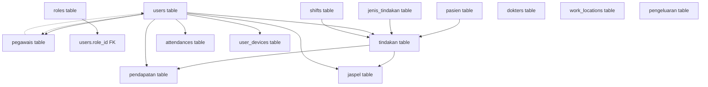

# Migration Dependency Analysis Report

## Executive Summary

This report analyzes all migration files in the Laravel project to identify foreign key dependencies, migration order requirements, and potential issues with the database schema.

## Migration Order and Dependencies

### 1. Base Tables (No Dependencies)
These migrations create base tables without foreign key constraints and must run first:

1. **0001_01_01_000000_create_users_table.php**
   - Creates: `users`, `password_reset_tokens`, `sessions` tables
   - Sessions table has a soft foreign key to users (no constraint)

2. **0001_01_01_000001_create_cache_table.php**
   - Creates: `cache`, `cache_locks` tables

3. **0001_01_01_000002_create_jobs_table.php**
   - Creates: `jobs`, `job_batches`, `failed_jobs` tables

4. **2025_07_11_092652_create_roles_table.php**
   - Creates: `roles` table

5. **2025_07_11_092652_create_shifts_table.php**
   - Creates: `shifts` table

6. **2025_07_11_092652_create_jenis_tindakan_table.php**
   - Creates: `jenis_tindakan` table

7. **2025_07_11_092652_create_pasien_table.php**
   - Creates: `pasien` table

8. **2025_07_11_155338_create_jenis_transaksis_table.php**
   - Creates: `jenis_transaksis` table

9. **2025_07_11_171316_create_work_locations_table.php**
   - Creates: `work_locations` table

10. **2025_07_12_072713_create_dokters_table.php**
    - Creates: `dokters` table

11. **2025_07_11_230305_create_pegawais_table.php**
    - Creates: `pegawais` table
    - Has soft foreign key to users.input_by (nullable)

12. **2025_07_12_105719_create_shift_templates_table.php**
    - Creates: `shift_templates` table

13. **2025_07_13_002306_create_leave_types_table.php**
    - Creates: `leave_types` table

14. **2025_07_13_002448_create_system_configs_table.php**
    - Creates: `system_configs` table

15. **2025_07_15_094706_create_system_settings_table.php**
    - Creates: `system_settings` table

16. **2025_07_15_094706_create_feature_flags_table.php**
    - Creates: `feature_flags` table

### 2. First-Level Dependencies (Depend on Base Tables)

These migrations have foreign keys to base tables:

1. **2025_07_11_092700_add_role_id_to_users_table.php**
   - Modifies: `users` table
   - Adds FK: `role_id` → `roles.id`
   - **Dependencies**: roles table

2. **2025_07_11_092652_create_tindakan_table.php**
   - Creates: `tindakan` table
   - Foreign Keys:
     - `pasien_id` → `pasien.id`
     - `jenis_tindakan_id` → `jenis_tindakan.id`
     - `dokter_id` → `users.id`
     - `paramedis_id` → `users.id` (nullable)
     - `non_paramedis_id` → `users.id` (nullable)
     - `shift_id` → `shifts.id`
   - **Dependencies**: pasien, jenis_tindakan, users, shifts tables

3. **2025_07_11_163901_create_attendances_table.php**
   - Creates: `attendances` table
   - FK: `user_id` → `users.id`
   - **Dependencies**: users table

4. **2025_07_11_165219_create_user_devices_table.php**
   - Creates: `user_devices` table
   - FK: `user_id` → `users.id`
   - **Dependencies**: users table

5. **2025_07_11_170845_create_face_recognitions_table.php**
   - Creates: `face_recognitions` table
   - FKs:
     - `user_id` → `users.id`
     - `verified_by` → `users.id` (nullable)
   - **Dependencies**: users table

6. **2025_07_11_170902_create_absence_requests_table.php**
   - Creates: `absence_requests` table
   - FKs:
     - `user_id` → `users.id`
     - `reviewed_by` → `users.id` (nullable)
   - **Dependencies**: users table

7. **2025_07_11_225513_create_gps_spoofing_detections_table.php**
   - Creates: `gps_spoofing_detections` table
   - FKs:
     - `user_id` → `users.id`
     - `reviewed_by` → `users.id` (nullable)
   - **Dependencies**: users table

8. **2025_07_12_001635_create_location_validations_table.php**
   - Creates: `location_validations` table
   - FK: `user_id` → `users.id`
   - **Dependencies**: users table

9. **2025_07_12_072730_create_jaspel_rekaps_table.php**
   - Creates: `jaspel_rekaps` table
   - FK: `dokter_id` → `dokters.id`
   - **Dependencies**: dokters table

10. **2025_07_12_105801_create_jadwal_jagas_table.php**
    - Creates: `jadwal_jagas` table
    - FKs:
      - `shift_template_id` → `shift_templates.id`
      - `pegawai_id` → `users.id`
    - **Dependencies**: shift_templates, users tables

### 3. Second-Level Dependencies

These migrations depend on tables created by first-level dependencies:

1. **2025_07_11_092700_create_pendapatan_table.php**
   - Creates: `pendapatan` table
   - FKs:
     - `tindakan_id` → `tindakan.id` (nullable)
     - `input_by` → `users.id`
     - `validasi_by` → `users.id` (nullable)
   - **Dependencies**: tindakan, users tables

2. **2025_07_11_092700_create_pengeluaran_table.php**
   - Creates: `pengeluaran` table
   - FKs:
     - `input_by` → `users.id`
     - `validasi_by` → `users.id` (nullable)
   - **Dependencies**: users table

3. **2025_07_11_092700_create_uang_duduk_table.php**
   - Creates: `uang_duduk` table
   - FKs:
     - `user_id` → `users.id`
     - `shift_id` → `shifts.id`
     - `input_by` → `users.id`
     - `validasi_by` → `users.id` (nullable)
   - **Dependencies**: users, shifts tables

4. **2025_07_11_123000_add_input_by_to_tindakan_table.php**
   - Modifies: `tindakan` table
   - Adds FK: `input_by` → `users.id`
   - **Dependencies**: tindakan, users tables

5. **2025_07_11_155338_create_pendapatan_harians_table.php**
   - Creates: `pendapatan_harians` table
   - FKs:
     - `jenis_transaksi_id` → `jenis_transaksis.id`
     - `user_id` → `users.id`
   - **Dependencies**: jenis_transaksis, users tables

6. **2025_07_13_012935_create_jaspel_table.php**
   - Creates: `jaspel` table
   - FKs:
     - `tindakan_id` → `tindakan.id` (nullable)
     - `user_id` → `users.id`
     - `shift_id` → `shifts.id` (nullable)
     - `input_by` → `users.id`
     - `validasi_by` → `users.id` (nullable)
   - **Dependencies**: tindakan, users, shifts tables

### 4. Complex Dependencies and Modifications

1. **2025_07_11_162113_change_pendapatan_harians_relation_to_pendapatan.php**
   - Modifies: `pendapatan_harians` table
   - Changes FK from jenis_transaksi to pendapatan
   - **Dependencies**: pendapatan_harians, pendapatan tables

2. **2025_07_12_023721_create_pengeluaran_harians_table.php**
   - Creates: `pengeluaran_harians` table
   - FKs:
     - `pengeluaran_id` → `pengeluaran.id`
     - `user_id` → `users.id`
     - `validasi_by` → `users.id` (nullable)
   - **Dependencies**: pengeluaran, users tables

3. **2025_07_13_100412_fix_foreign_keys_in_tindakan_table.php**
   - Modifies: `tindakan` table foreign keys
   - Changes dokter_id to reference dokters table instead of users
   - Changes paramedis_id and non_paramedis_id to reference pegawais table
   - **Dependencies**: tindakan, dokters, pegawais tables

4. **2025_07_15_231720_add_pegawai_id_to_users_table.php**
   - Adds FK: `pegawai_id` → `pegawais.id` to users table
   - **Dependencies**: users, pegawais tables

## Critical Issues Identified

### 1. Circular Dependencies
- **CRITICAL**: `2025_07_15_231720_add_pegawai_id_to_users_table.php` creates a circular dependency:
  - `users` table gets FK to `pegawais` table
  - `pegawais` table has FK to `users` table (input_by)
  - This creates a circular reference that could cause migration issues

### 2. Migration Timestamp Conflicts
Several migrations share the same timestamp prefix `2025_07_11_092652`:
- create_roles_table.php
- create_shifts_table.php
- create_jenis_tindakan_table.php
- create_pasien_table.php
- create_tindakan_table.php

This could cause unpredictable migration order within this group.

### 3. Foreign Key Modifications
- `2025_07_13_100412_fix_foreign_keys_in_tindakan_table.php` changes existing foreign keys, which requires:
  1. Dropping existing constraints
  2. Ensuring target tables exist
  3. Re-creating constraints

### 4. Missing Parent Tables
- Several migrations reference tables that might not exist at migration time
- The Spatie permission tables are created mid-sequence but some earlier migrations might expect them

## Dependency Graph



## Recommendations

### 1. Fix Circular Dependencies
- Remove the `pegawai_id` foreign key from users table OR
- Remove the `input_by` foreign key from pegawais table OR
- Make one of them a non-constrained reference

### 2. Standardize Migration Timestamps
- Ensure unique timestamps for all migrations
- Use incremental timestamps for related migrations

### 3. Create a Migration Order Script
```bash
# Suggested migration order
php artisan migrate --path=database/migrations/0001_01_01_000000_create_users_table.php
php artisan migrate --path=database/migrations/0001_01_01_000001_create_cache_table.php
php artisan migrate --path=database/migrations/0001_01_01_000002_create_jobs_table.php
php artisan migrate --path=database/migrations/2025_07_11_092652_create_roles_table.php
# ... continue in dependency order
```

### 4. Add Foreign Key Checks
Add a pre-migration check script to verify all parent tables exist before running migrations with foreign keys.

### 5. Consider Using Database Transactions
Wrap related migrations in database transactions to ensure atomicity.

## Conclusion

The migration structure has several critical issues that need immediate attention:
1. A circular dependency between users and pegawais tables
2. Timestamp conflicts that could cause unpredictable migration order
3. Complex foreign key modifications that could fail if not properly sequenced

These issues should be resolved before deploying to production to ensure reliable database schema creation.